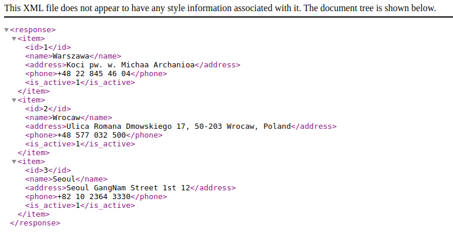

# Offline_Stores
Example Magento 2 Module for VSF Custom Entity Type example

## How to install
1. Clone this repo, open the directory you will see _Divante_ folder. 
2. Copy _Divante_ folder into your magento project under `app/code/` directory.
3. Run the magento command at the magento root folder `bin/magento setup:update`

## Note
- It uses declarative schema by default so you need to have Magento 2 above 2.3 
- But don't worry if your Magento 2 version less than 2.3, uncomment `Offline/Setup/InstallSchema.php` file

## How to use
Once the module is installed successfully, visit http://localhost/rest/default/V1/offline-stores/
Then you should see a screen like below

